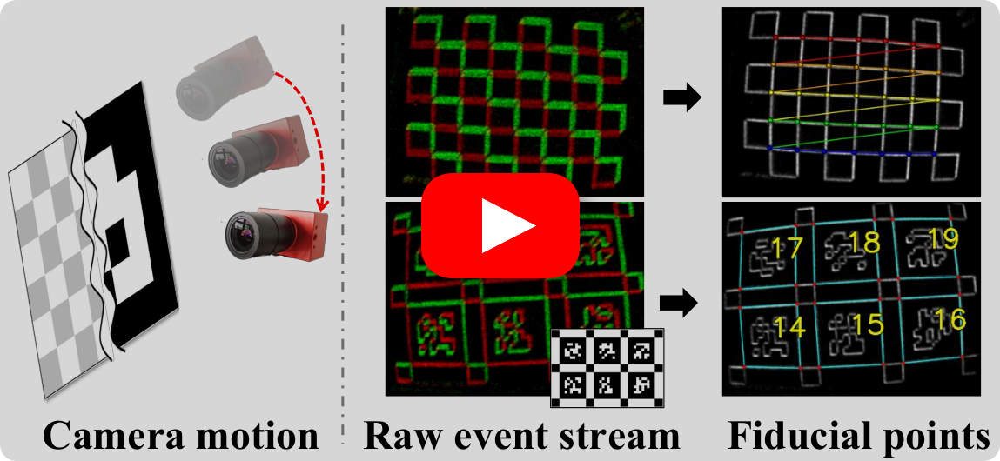

<p align="center">
  <h1 align="center">From Corners to Fiducial Tags: Revisiting Checkerboard Calibration for Event Cameras</h1>
  <p align="center">
    <a href="https://taehun-ryu.github.io/" rel="external nofollow noopener" target="_blank"><strong>Taehun Ryu</strong></a>
    ·
    <a href="https://kang-changwoo.github.io/" rel="external nofollow noopener" target="_blank"><strong>Changwoo Kang</strong></a>
    ·
    <a href="https://vision3d-lab.github.io/" rel="external nofollow noopener" target="_blank"><strong>Kyungdon Joo</strong></a>
  </p>
</p>

<p align="center">
  <a href="https://openaccess.thecvf.com/content/CVPR2026/papers/Ryu_From_Corners_to_Fiducial_Tags_Revisiting_Checkerboard_Calibration_for_Event_CVPR_2026_paper.pdf"></a>
  <a href="https://openaccess.thecvf.com/content/CVPR2026/supplemental/Ryu_From_Corners_to_CVPR_2026_supplemental.pdf"></a>
  <a href="https://vision3d-lab.github.io/corner2tag/"></a>
  <a href="https://taehun-ryu.github.io/corner2tag/"></a>
</p>

> This repository is the official implementation of the paper "From Corners to Fiducial Tags: Revisiting Checkerboard Calibration for Event Cameras".

<p align="center">
  <a href="https://youtu.be/Nc1FxERhoXU">
    
  </a>
  <br>
  <sub><b>Project video.</b> Watch on YouTube.</sub>
</p>

## News
<!-- :tada: celerbrate -->
<!-- :rocket: major release -->
<!-- :sparkles: new feature / implementation -->
<!-- :bug: bug fix -->
- 26.09.01. :sparkles: Data converters and a Docker environment are now available.
- 26.08.14. :rocket: Checkerboard calibration is now available!
- 26.04.09. :tada: Our CVPR paper was selected as **Highlight**! (14.1% of accepted papers, 3.6% of total submissions.)
- 26.02.23. :tada: **corner2tag** was accepted to **CVPR 2026**! (acceptance rate: 25.42%)

## How to use

For detailed setup and usage instructions, please refer to [the full documentation](https://taehun-ryu.github.io/corner2tag/).

From the repository root:

### Build

```bash
cmake -S . -B build -DCORNER2TAG_STANDALONE=ON
cmake --build build --parallel
```

### Data Conversion

Convert supported ROS1 bag or AEDAT4 recordings to the HDF5 format used by corner2tag.

```bash
python3 data_converter/dvs_msgs_to_h5.py /path/to/recording.bag
python3 data_converter/inivation_aedat4_to_h5.py /path/to/recording.aedat4
```

### Checkerboard Calibration

Configure `config/checkerboard.yaml`, then run:

```bash
./build/checkerboard config/checkerboard.yaml
```

### Docker

If you need an isolated environment, run checkerboard calibration with Docker.

```bash
bash docker/run_checkerboard_docker.sh /absolute/path/to/data recording.h5
```

## Acknowledgments

This work is built on several great research works, thanks a lot to all the authors for sharing their works.

- [Event Cameras, Contrast Maximization and Reward Functions: An Analysis [CVPR 2019]](https://github.com/TimoStoff/events_contrast_maximization)
- [Target-free Extrinsic Calibration of Event-LiDAR Dyad using Edge Correspondences [RA-L 2023]](https://github.com/wlxing1901/contrast-maximization-for-event-cameras)

## Citation
```latex
@InProceedings{ryu2026corner2tag,
    author    = {Taehun Ryu and Changwoo Kang and Kyungdon Joo},
    title     = {From Corners to Fiducial Tags: Revisiting Checkerboard Calibration for Event Cameras},
    booktitle = {IEEE/CVF Conference on Computer Vision and Pattern Recognition (CVPR)},
    year      = {2026},
}
```
