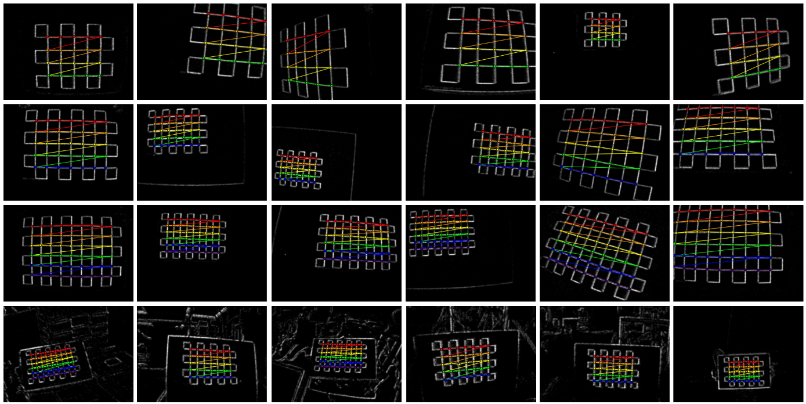

# Checkerboard Calibration

corner2tag calibrates an event camera from checkerboard corners detected in an event stream.



*Example checkerboard detections from a multi-view capture sequence.*

## Build

From the repository root:

```bash
cmake -S . -B build -DCORNER2TAG_STANDALONE=ON
cmake --build build --parallel
```

## Prepare the Input

The input must be an HDF5 event file with the layout described in [Prerequisites](prerequisite.md#input-preconditions). Events must be ordered by timestamp. Use the provided [data converters](data-conversion.md) for supported ROS1 bag and iniVation AEDAT4 recordings.

Use `config/checkerboard.yaml` as the starting point. Update at least the following fields for your data:

```yaml
h5_path: "/path/to/events.h5"
out_dir: "results/checkerboard/"

width: 346
height: 260

board_h: 5
board_w: 7
square_size: 0.35
fixed_window_us: 100000  # 0.1 s
```

`board_h` and `board_w` are the numbers of **inner corners**, not squares. For example, a board with 6 × 8 squares has 5 × 7 inner corners. Set `square_size` in a consistent physical unit; it is recorded in the output and determines the scale of the estimated board poses.

The remaining fields in the configuration control contrast maximization, corner refinement, checkerboard validation, and OpenCV calibration. The provided values are the release defaults.

## Run

From the repository root:

```bash
./build/checkerboard config/checkerboard.yaml
```

Window visualizations are shown automatically when a display server is available. To explicitly enable them, set `CORNER2TAG_ENABLE_GUI=1` before running the command.

## Outputs

Each run is written to a timestamped directory under `out_dir`:

```text
results/checkerboard/
└── run_YYYYMMDD_HHMMSS/
    ├── raw/                 # Event-frame visualizations
    ├── iwe/                 # Images of warped events
    ├── corner_detection/    # Detected and validated checkerboard corners
    ├── calibration.yaml     # Calibration result, when successful
    ├── calibration_poses.png
    └── calibration_reprojection.png
```

`calibration.yaml` contains the camera matrix, distortion coefficients, checkerboard geometry, the number of valid windows used, and the mean reprojection error in pixels. A calibration file is written only when the calibration succeeds.

### Per-window Outputs

<div style="display: flex; flex-wrap: wrap; gap: 12px; margin-bottom: 2em; text-align: center;">
  <div style="flex: 1 1 0; min-width: 220px;">
    
    <strong>Raw events</strong><br>
    <span style="font-size: 0.9em;">Events and motion</span>
  </div>
  <div style="flex: 1 1 0; min-width: 220px;">
    
    <strong>IWE</strong><br>
    <span style="font-size: 0.9em;">Motion-compensated events</span>
  </div>
  <div style="flex: 1 1 0; min-width: 220px;">
    
    <strong>Corner detection</strong><br>
    <span style="font-size: 0.9em;">Validated, ordered corners</span>
  </div>
</div>


### Inspecting Results

Check the images in `corner_detection/` before using the calibration result. They are written only for windows whose checkerboard corners pass ordering and validity checks. The colored polylines should trace the board's inner-corner rows consistently; crossings, missing corners, or rows that do not follow the board are signs that the window should not be trusted.

Use `calibration.yaml` together with `calibration_reprojection.png` to assess the final result. The reprojection error is the mean distance, in pixels, between detected corners and corners projected by the estimated camera model.

## Practical Notes

- Capture the checkerboard across a range of positions, distances, and tilts for a robust calibration.
- Check the `corner_detection` images before relying on the calibration result.
- Keep the sensor size, inner-corner counts, and square size consistent with the physical board and input stream.
